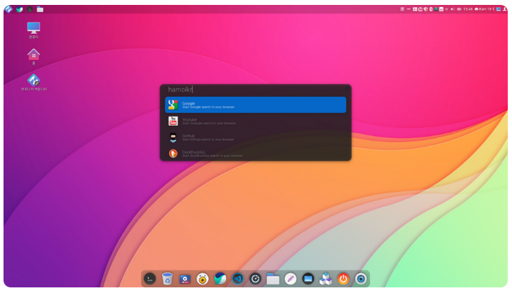
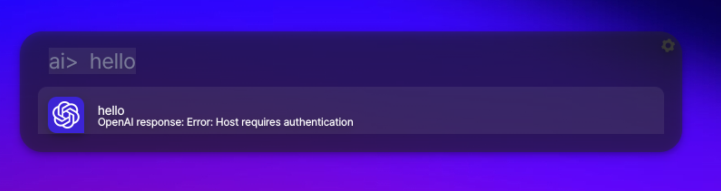

# 하모니카 런처

하모니카에서 사용하는 런처 프로젝트

단축키 Alt+Space 키를 눌러 PC에 설치된 프로그램과 웹에서 바로 검색할 수 있습니다.




upstream : https://github.com/albertlauncher/albert.git


# Install

## HamoniKR (>=3.0), Ubuntu (>=18.04)
```
wget -qO- https://pkg.hamonikr.org/add-hamonikr.apt | sudo -E bash -

sudo apt install albert
```

# Support

* [HamoniKR Community](https://hamonikr.org/)


# TO-DO



 * GPT 질문응답 플러그인을 개발했지만, OpenAI 의 API 응답이 제댈로 오지않는 버그로 중단

 * 해결되었다고 OpenAI 에서 응답했지만 여전히 동일한 현상
 * https://community.openai.com/t/probable-openai-bug-insufficient-quota-error-on-paid-account-with-available-balance/331067

```
# 요청 테스트
curl https://api.openai.com/v1/chat/completions \                                                                                                            
  -H "Content-Type: application/json" \
  -H "Authorization: Bearer <API_KEY>" \
  -d '{
    "model": "gpt-3.5-turbo",
    "messages": [{"role": "user", "content": "Say this is a test"}],
    "max_tokens": 10
  }'
```
```
# 응답
{
    "error": {
        "message": "You exceeded your current quota, please check your plan and billing details. For more information on this error, read the docs: https://platform.openai.com/docs/guides/error-codes/api-errors.",
        "type": "insufficient_quota",
        "param": null,
        "code": "insufficient_quota"
    }
}

```